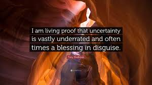

# A Note on Proof and Certainty

I am not writing systematic theology. I am writing down what I believe I have discovered on a personal journey of exploration. My standard for what counts as a provisional “law” is fourfold: it lines up with scripture; the Spirit of Truth witnesses to it; it is recognized (at least partially) by a community of practitioners; and it is testable in the natural, meaning it produces observable results in the lives of people who operate according to it.

Along the way, I will give you my confidence tier on each major claim. That is not false modesty. It is intellectual honesty about the fact that I am exploring terrain that has not been fully mapped, and I’d rather tell you a claim sits at the Reasonably Inferred tier than pretend it is settled when it isn’t. The early scientists who first discovered natural laws held them provisionally, too, and they were right to do so.

When I assign a confidence tier, I am counting independent lines of evidence (a claim with multiple scriptural texts approaching it from different angles, plus corroborating patterns in experience, plus conceptual coherence with adjacent claims, gets a higher tier than one resting on a single passage or single analogy), weighting the type of evidence (direct propositional statements in scripture outweigh structural inferences like “this cluster behaves like a gateway, therefore it is one,” which in turn outweigh analogical reasoning from physics), and flagging where my own interpretation is doing the work (good scriptural grounding for a claim does not mean my reading of the causal arrows is settled). The Sin Blockage law in Volume 2 — Clearly Taught, with explicit positive and negative scriptural statements, millennia of consistent tradition, and direct experiential confirmation — serves as the anchor against which everything else is calibrated.

The tiers are not Bayesian posteriors, and they are not reproducible in the sense that another careful reader would necessarily arrive at the same tier. They are epistemic signals — shorthand for how much weight I put on a claim before it is tested, refined, and challenged by the community. The Speculative tier on the spiritual force equation in Volume 3, for example, is not saying “this is probably wrong.” It is saying “the structure may be right, but the specific mathematical form is genuinely open — don’t build on this particular formulation yet.”

Wayne Grudem’s approach in Systematic Theology uses a qualitative rather than numerical confidence structure — distinguishing between what scripture clearly teaches, what can be reasonably inferred from it, and what is speculative or provisional. I have accepted that recommendation. The three tiers operating throughout the corpus are: **Clearly Taught** — taught directly by scripture or directly confirmed by community testing; **Reasonably Inferred** — reasonably inferred from scripture, still in need of community testing; **Speculative** — interesting enough to pursue, not yet solid enough to build on. The goal is not to make the investigation look more rigorous than it is — it is to make the actual degree of rigor visible, including where it is low.

Volume 6 gives these four criteria more formal names — independent scriptural lines, experiential corroboration, conceptual coherence, and consistency with tradition — and turns them into a hard requirement for anyone who wants to propose a refinement to the core record. What I have been doing privately for twenty years+ becomes the community's public discipline.
