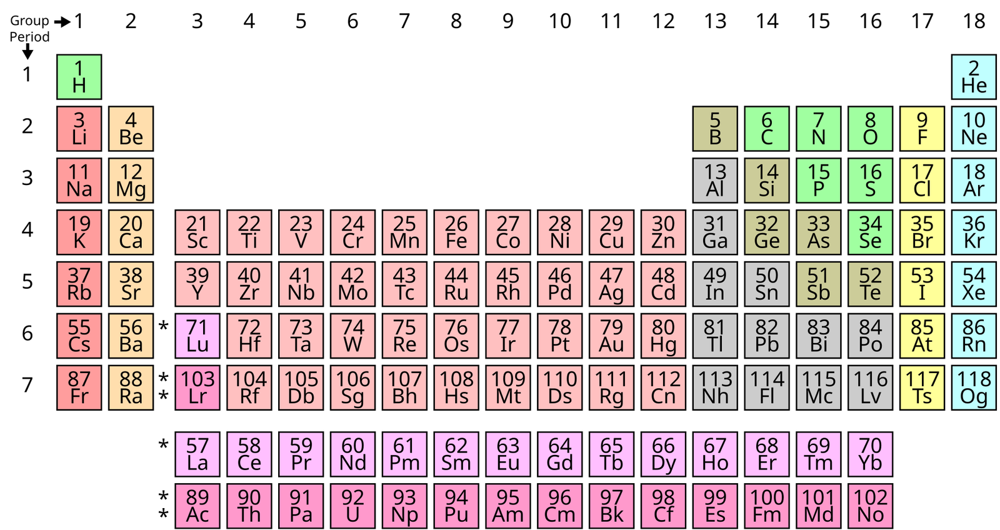

# The Periodic Table — See Volume 5

The Periodic Table of Spiritual Laws was drafted as this volume’s closing chapter through five iterations and is now consolidated in Volume 5 — Heart Formation Training — alongside the Tool Inventory and the Formation Companion chapters, so that the table serves as a comprehensive reference for the whole corpus rather than the closing argument of a single volume. Volume 5 holds the synced version: the table organizes every analyzed law (47 entries at the current revision, including the 38 Foundational Laws of wide consent established in this volume) by two axes — Period 0–5 for scale of operation, Group I–VI for dimension of the person primarily addressed — with directionality tags (V/H/B/I) and the Mirror field this volume earned through its analytical work.

The chapter retains its original analytical structure under its new Vol 5 framing as a summing and organizing reference: Two Axes (the analytical instrument’s shape), What the Shape Reveals (insights surfaced by the consolidated view), Slim Format and Reference List (the data), Six Group Families (structural closing), and Six Priority Open Unknowns (suggested research actions). For the full table see Volume 5’s chapter The Periodic Table of Spiritual Laws — A Summing and Organizing Reference. Within this volume, the per-FL Periodic Table placement is noted in each Foundational Law’s description; the consolidated view is in Volume 5.
