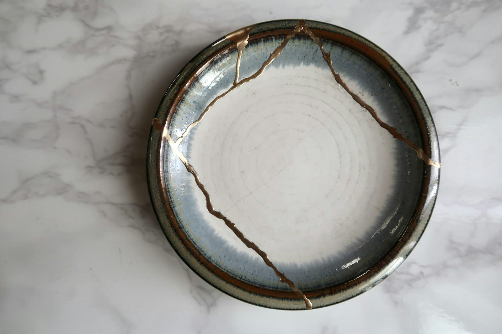

# First Exploration (B): Wound vs. Sin — The Structural Distinction

## A Distinction the Volume Has Always Operated On
The Heart Soil diagnostic in Exploration 1 names *that* something is blocking growth in a given region of the heart; it does not name *what kind* of blockage it is. The corpus has been operating on a structural distinction between two categories of blockage for as long as I have been writing this volume, but I have never stated the distinction in a single place. This Exploration does.

The two categories are **wounds** and **sin**. A wound is what was *done to* the person — suffered, often pre-volitional, often inflicted before the person had agency to refuse it, calling for healing and the Spirit's truth-encounter. A sin is what the person *has done* — owned, volitional, calling for confession and where applicable restoration. The two categories require different pastoral responses, route to different tool families, and carry different theological weight. The diagnostic discernment of which category a given blockage falls into is a Companion competency — and conflating the two miscarries the response in either direction.

When a wound is misdiagnosed as a sin, the participant is sent to confession for what was done to them, which compounds shame and forecloses on the healing the wound actually needs. When a sin is misdiagnosed as a wound, the participant is offered healing for what they did, which forecloses on the confession the sin actually requires. Either error leaves the participant worse off than no intervention at all. The diagnostic question — *is this primarily wound or primarily sin?* — is therefore not a refinement detail; it is structurally upstream of the tool selection in Exploration 6.

The categories are not mutually exclusive. Most actual situations carry both: a wound that has hardened into a habit of sinning out of the wound; a sin that has been suffered as a wound by someone else; a long marriage carrying both wronging and being-wronged in the same person. But the structural distinction holds at the diagnostic altitude even when the situations are mixed; the Companion's discernment is to name which category is operating in *this* moment of the work and route the response accordingly.

## A Clarifying Clause for the Reformed Tradition
I want to be explicit about one thing the Reformed tradition would (rightly) be alert to in a wound-vs-sin framing. The distinction is not a claim that wounds exist in a moral vacuum outside the broader sin-condition of the person. They do not. Every wound is suffered by a person who is themselves under the gospel's account of human sinfulness; wound work is undertaken *under* the sin-condition, not in escape from it. The structural distinction names that wound and sin operate as different mechanisms requiring different responses *within* the broader theological frame of the gospel, not that wound work somehow exempts the participant from the gospel's account of who they are.

**Proposed Law (Diagnostic): Heart blockages fall into two structurally distinct categories: wounds (what was done to the person, suffered, often pre-volitional, calling for healing and the Spirit's truth-encounter) and sin (what the person has done, owned, calling for confession and where applicable restoration). The two categories require different pastoral responses and different tool families. Diagnostic discernment of which category a given blockage falls into is a Companion competency, and conflating the two miscarries the response in either ****direction. The categories are not mutually exclusive — most actual situations carry both — but the diagnostic distinction is structural. Two clauses sit alongside the structural distinction. Reformed clarifying clause: wound work itself is undertaken under the broader sin-condition of the person, not in escape from it. Balancing clause: the wound is genuinely what was done to the participant, the participant is not at fault for what was done to her, and the broader sin-condition does not erase the pre-volitional character of the wound or assign her responsibility for it. Pre-volitional traumatic wounds enter under the sin-condition of those who wounded her, not under her own (cf. Ezek. 18:20; Matt. 18:6; the testimony of Tamar in 2 Sam. 13:1–22). Wound work and confession of personal sin are both required of the disciple; they are not the same work, and they do not collapse into each other.**

**Certainty: Clearly ****Taught  ***One** of the corpus's most load-bearing implicit distinctions. The entire architecture of Vol 2 Part I has depended on this distinction; the structural claim is now made explicit. The categories are visible in scripture (Psalm 147:3 for the wound side; 1 John 1:9 for the sin side; Hebrews 12:15 distinguishing root-of-bitterness from sin), but the explicit structural distinction is not in any single biblical text — it is an inference from the pattern of scriptural treatment of the two poles. The Reformed-friendly clarifying clause addresses the foreseeable concern that any wound-before-sin framing escapes total depravity; the balancing clause addresses the foreseeable pastoral concern (Eldredge’s, in particular) that the Reformed clause could be heard by a wounded participant as handing her a portion of responsibility for what was done to her. Together the two clauses hold the doctrinal and pastoral altitudes of the wound/sin distinction without **collapsing either** into the other.*

**Cross-references.** Upstream: V1.Ax1; V2.Exp1 (Heart Soil — the broader diagnostic frame). Downstream: V2.Exp2 / V2.Exp2A (wound side targets the energetic and identity blockage laws); V2.Exp4 (sin side routes to confession); V2.Exp6 (Tool Map sorts tools by which category they address); V2.Exp6A (image-bearing dignity work assumes the wound/sin distinction).

**Vol 2 — Exploration 2 — Operational Law**
