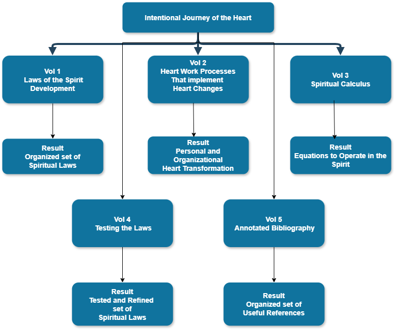

# Taxonomy Key: How This Volume Classifies Its Explorations

Volume 2 builds on the Structural and Operational law types from Volume 1 and adds three new categories. This is the complete taxonomy for this volume, showing how each type relates to the investigations in Volumes 1 and 3.

## Inherited: Structural and Operational Laws
The full foundation for this taxonomy — including the distinction between Structural Laws (what exists and how it is organized) and Operational Laws (what causes what) — is laid in Volume 1’s Taxonomy Key and in the Intro’s “A Note on Two Kinds of Laws”; readers new to this volume should start there.

## Diagnostic Laws (New in Vol 2)
A Diagnostic Law refers to a condition that prevents the Vol 1 operational laws from functioning properly. The Heart Soil exploration is an example of a Diagnostic Law: it identifies the internal conditions that hinder the Word → Hearing → Faith chain from yielding fruit. Diagnostic Laws do not explain how things work when the channel is open — instead, they describe what it looks like when it is blocked and why. They serve as the clinical category: they identify the presenting condition and point toward the appropriate clearing tool.

## Tool-Application Laws (New in Vol 2)
A Tool-Application Law explains how a particular clearing tool corresponds to a specific blockage type. These laws focus not directly on spiritual dynamics but on the proper preparation for the Spirit to work. The Tool Map exploration serves as the main Tool-Application Law in this volume. The key principle is that using a tool on the wrong type of blockage won't produce a release and might cause additional harm. Recognizing the type of blockage before choosing a tool is a skill that requires expertise from the Vol 1 Wisdom cluster.

## Developmental Laws (New in Vol 2)
A Developmental Law explains how the capacity for the spiritual life develops over time through deliberate practice. These laws are neither structural nor diagnostic; they describe movement and growth. The Affective Taxonomy mapping serves as the main framework for Developmental Laws in this volume: the five-level progression (Receiving → Responding → Valuing → Organization → Characterization) illustrates not just a state but a direction of development. Developmental Laws address the key question: once the channel is clear and the soil is ready, how does life in the Spirit deepen?

## Foundational Practice
A Foundational Practice is not a law in the same sense as the other types in this volume; it is a sustained pattern of attention that the historic Christian tradition has practiced as a means of grace. The Foundational Practice type names what sits beneath the diagnostic, tool-application, and developmental work this volume catalogs — the soil-conditioning a soul does over years so that, when a blockage arrives or a hearing matures, there is a soul present to do the work. V2.Exp0B (The Contemplative Substrate) is the first entry of this type and names four practices (fixed-hour prayer, lectio divina, silent waiting, vigilantia cordis) that the rest of this volume's catalog assumes. The substrate is not parallel to the Diagnostic / Tool-Application / Developmental tier; it sits beneath it. A Companion who has not practiced what sits beneath cannot reliably operate what sits above. These are discussed in the Formation Companion discussion in Vol 5 ([FC](../volume-5-references/source-pdfs/fc-formation-companion.pdf){: .pdf-popup data-pdf-label="FC — Formation Companion" }).

## How This Taxonomy Connects to Volumes 1 and 3

Volume 1’s structural and operational laws explain how things work when the channel functions. Volume 2’s diagnostic, tool-application, and developmental laws explain what to do when the channel isn't working and how to develop it over time once it does. Volume 3 will reframe both sets: it considers the Vol 1 laws as the landscape, while the Vol 2 conditions are seen as local minima (emotional knots) and trajectory variables (developmental laws) within that landscape. The Affective Taxonomy introduced in Vol 2 becomes a measurement protocol in Vol 3 — the most manageable current method I know of for operationalizing spiritual distance.

VOL 1 CONNECTION: The main premise of this entire volume — that the Vol 1 laws are valid but obscured — requires a clear understanding of the Vol 1 laws first. If you haven't worked through Vol 1’s explorations, the diagnostic framework here will be less clear than it should be. Specifically, the Heart Soil diagnostic (Exp. 1) depends on familiarity with the Word → Hearing → Faith operational law (Vol 1, Exp. 1) and the nested person structure (Vol 1, Exp. 2).

VOL 3 CONNECTION: Volume 3 employs the Affective Taxonomy introduced in this volume as its main measurement protocol for spiritual distance. The five-level progression serves as a tool for translating the abstract concept of "spiritual distance" into observable behavioral indicators. Volume 3’s exploration of this connection asks: Can Affective Taxonomy levels be linked with REVEAL type stages across a congregation? That research question relies on the framework from Volume 2 as its foundation.

**How the Formation Documents Connect to This Volume**

Volume 2 (this volume) is the central focus of the Formation Documents’ concerns. Everything in the diagnostic, therapeutic, and developmental explorations here directly corresponds to [HFT](../volume-5-references/source-pdfs/hft-heart-formation-theology.pdf){: .pdf-popup data-pdf-label="HFT — Heart Formation Theology" }’s Affective Taxonomy, [SST](../volume-5-references/source-pdfs/sst-soul-spirit-taxonomies.pdf){: .pdf-popup data-pdf-label="SST — Soul and Spirit Taxonomies" }’s soul taxonomy, or [MSFIG](../volume-5-references/source-pdfs/msfig-model-spiritual-formation.pdf){: .pdf-popup data-pdf-label="MSFIG — Model of Spiritual Formation for Individuals and Small Groups" }’s integrated model. The Formation Documents stem from the same investigation — they are the academic expression of what this volume is exploring pastorally. While this volume asks what blocks the channel and how to clear it, HFT and MSFIG inquire what progressive opening looks like from within, and how we can recognize it. Where this volume asks how the hearing faculty develops, SST’s soul and spirit taxonomies provide the developmental framework. Reading them together is like viewing two sides of the same map. (The full text of all five Formation Document PDFs — TA, HFT, SST, MSFIG, FC — is listed on the [Vol 5 Introduction](../volume-5-references/introduction.md) page.)

I mention the REVEAL study progression because it identified a staged model of spiritual formation. However, I have found the NCD approach to individual, small-group, and church-wide development much more helpful for both understanding and application. I have used their assessment tools for both individual and small-group feedback. My church has not adopted the church-wide tools, but I think they should, and I think they would find the feedback helpful. So, what follows is a mix of these two approaches that have been successful across multiple churches and denominations. I think the Affective Taxonomy approach to understanding this progression is more grounded and helpful, but it would certainly be harder to implement.

For any model, the reality of this journey is that it is not linear. Anyone on such an intentional journey will recognize that. The phrase “two steps forward and one step back” captures the idea. The core issue is, which way are you pointing at any given time? The formation documents discuss the role of suffering in this non-linear path in some detail.  There are mountain tops and deep valleys on the journey. Faith and hope are what keep us focused in the right direction.

There is a picture that the Lord showed me many years ago that is relevant to what follows. I saw my life, my heart, as an L-shaped pipe. The top was receiving God’s love for me and the world. The output flowed into a dry, dusty world, thirsty for his love. My output was just a trickle. I had too many barnacles interfering with the flow, slowing it down until only a little could get through. I understood that working out your salvation with fear and trembling might mean for me: to clear out the barnacles so his love can flow more and more. The following discussion on how heart knots interfere with hearing and obeying God puts more details on that thought.

## On Sub-Explorations, "Refined" Versions, and Exploration O

Three conventions run through this volume that a reader should know about before reaching them.

**Sub-Explorations** (the letter-suffix entries: 1B, 2A, 2B, 2C, 6A, 6B, 6C, 7A, 8B, 9A). Each numbered Exploration can carry one or more letter-suffix sub-Explorations that elaborate, extend, or add a structural distinction the main Exploration depends on. They are not optional asides. They are material that did not fit cleanly under the main Exploration's single argument but operates downstream of it and is needed to make the main Exploration's work go. Exploration 1 names the Heart Soil diagnostic; Exploration 1B (Wound vs. Sin) adds the structural distinction the Heart Soil work cannot operate without. Exploration 6 names the Tool Map; Explorations 6A, 6B, and 6C add the image-of-God, re-integration, and discernment-from-outside-the-frame articulations the Map requires to be deployed cleanly. The letter suffix signals: *this is structurally tied to the numbered Exploration above it; read them together.*

**"Refined" versions** (V2.Exp4 refined, V2.Exp8 refined). Some Explorations in this volume have been substantively rewritten since their first articulation; "refined" marks the version that is current and authoritative. The earlier statement is no longer the operating form. Where the corpus's downstream material — Vol 5 Part VI, the FotH curriculum, the FotH Companion Handbooks — cross-references **V2.Exp4 refined** or **V2.Exp8 refined**, the reference is to the version in this volume as it currently stands. The "refined" qualifier is a version marker, not a content marker for some sub-part of the Exploration.

**Exploration O — the Operating Ground.** Before the numbered Explorations begin, Exploration O ("The Christian Companion's Framework — Tool Import Discipline") names the discipline under which the rest of the volume's tool-and-protocol work operates. Exploration O is not Part I, not a sub-Exploration of any numbered entry, and not optional preliminary material — it is the framework every numbered Exploration that follows presupposes. The letter O (not the number zero) marks it as the *Operating Ground* of the volume; the numbered Explorations (1–10) are what the Operating Ground makes possible.

**PART I**

*Diagnosis: Why the Channel Gets Blocked*

**Vol 2 — Exploration ****O**** — Tool Import Discipline (Operating Ground)**
